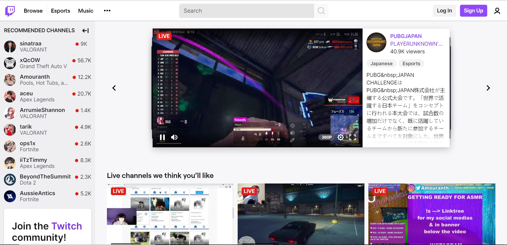
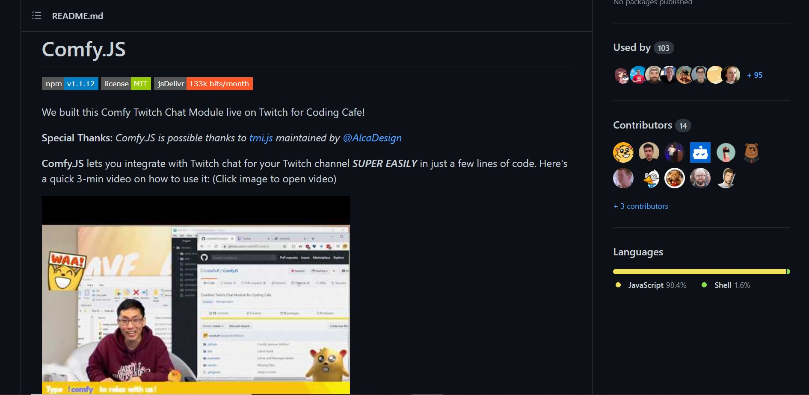
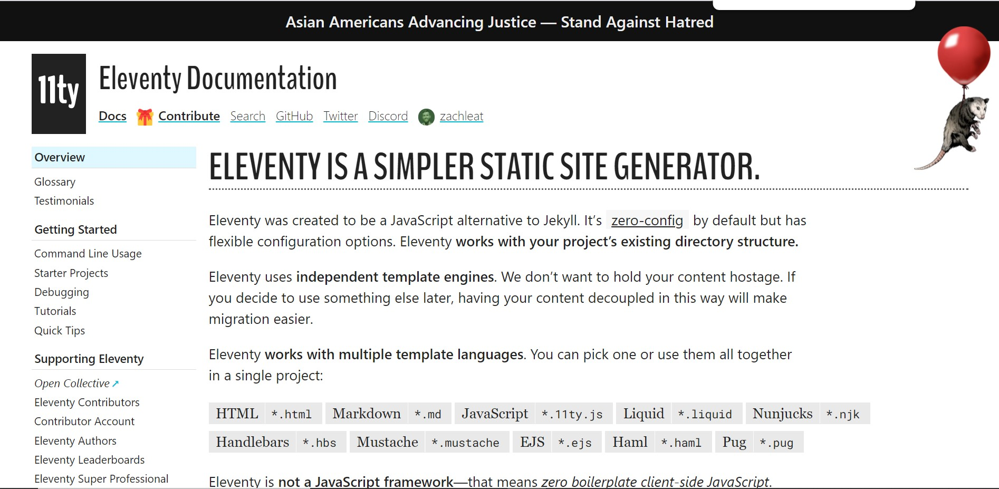

# Twitch-Using-ComfyJS-and-11ty

## Twitch
Twitch is an American video live streaming service that focuses on video game live streaming, including broadcasts of esports competitions. In addition, it offers music broadcasts, creative content, and more recently, "in real life" streams. It is operated by Twitch Interactive, a subsidiary of Amazon.com, Inc.

 

Read more about Twitch : [here](https://en.wikipedia.org/wiki/Twitch_(service))

## ComfyJS
ComfyJS allows you to integrate with Twitch chat for your Twitch channel SUPER EASILY in just a few lines of code. 

 

You can refer to a quick 3-min video provided in its documentation on how to use it : [here](https://github.com/instafluff/ComfyJS)

## Eleventy ( or 11ty )
Eleventy was created to be a JavaScript alternative to Jekyll. It’s zero-config by default but has flexible configuration options. It works with your project’s existing directory structure along with independent template engines. It dosen’t want to hold your content hostage. If you decide to use something else later, having your content decoupled via eleventy can make migrations easier. It also works with multiple template languages.

 

You can refer to the 11ty documentation for more information : [here](https://www.11ty.dev/docs/)
